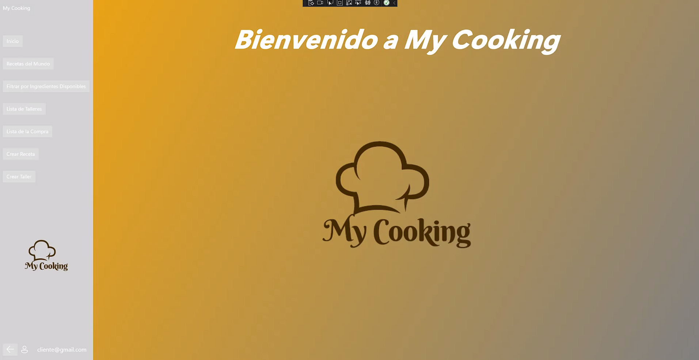
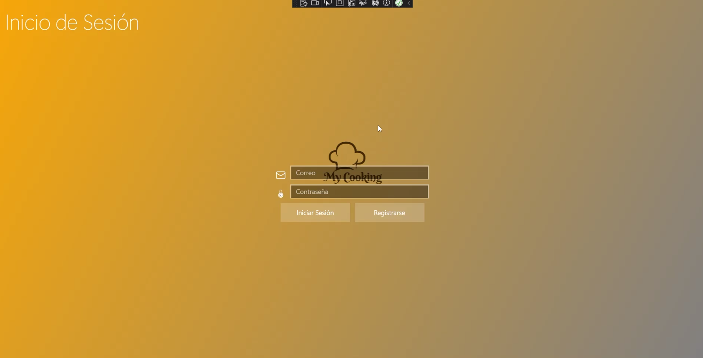
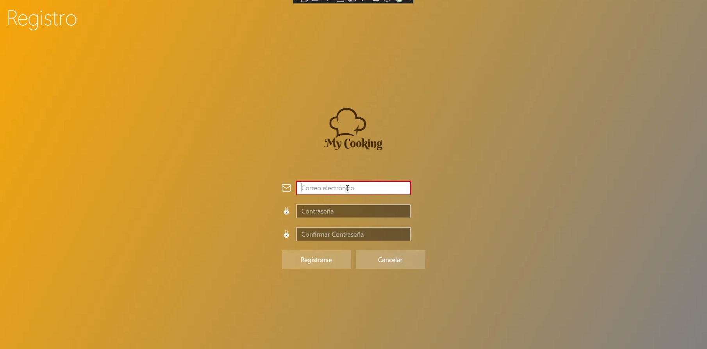
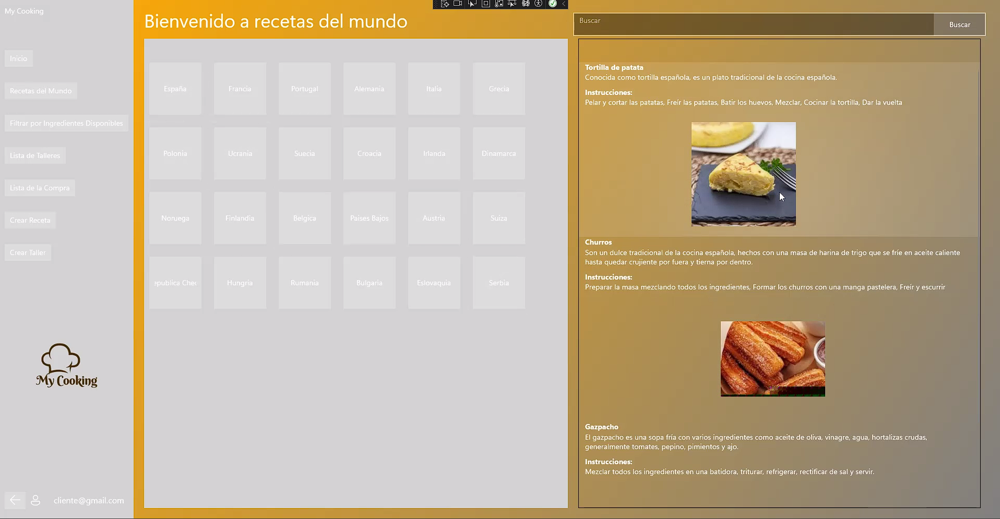
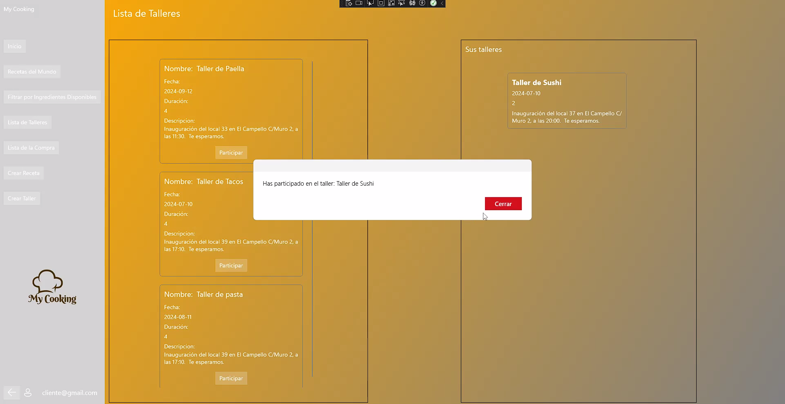
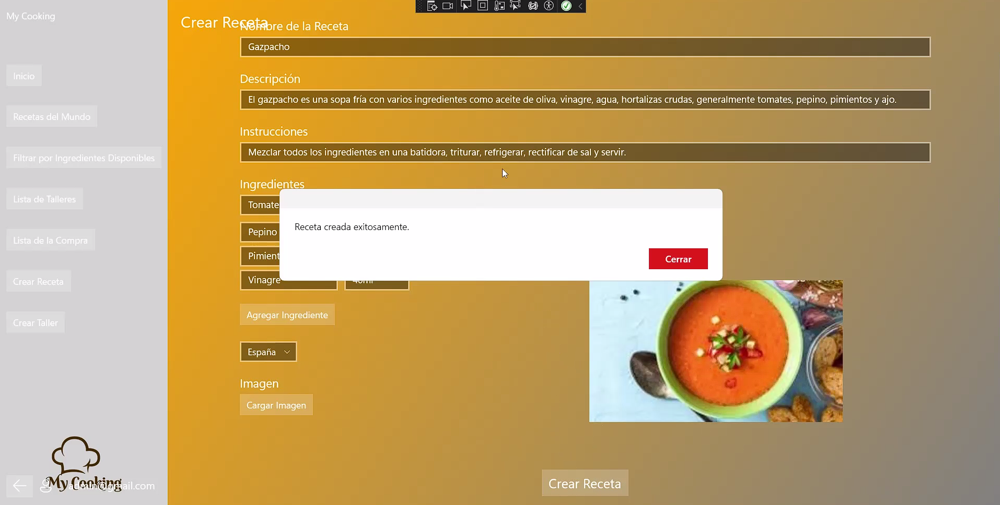

# 🍽️ My Cooking

**My Cooking** es una aplicación de escritorio diseñada para los amantes de la cocina. Permite buscar, gestionar y organizar recetas de manera eficiente, además de contar con funcionalidades como listas de compra y talleres de cocina.  

📌 **Tecnologías:** C# | UWP | Node.js | Express | MySQL | Sequelize  
📌 **Plataforma:** Windows (Universal Windows Platform - UWP)  

## 🚀 Funcionalidades Principales
✅ **Explorar Recetas del Mundo**: Busca recetas por país o ingredientes.  
✅ **Gestión de Recetas**: Añade, edita y organiza recetas (solo administradores).  
✅ **Lista de Compra**: Guarda ingredientes y planea tus compras.  
✅ **Talleres de Cocina**: Descubre y participa en talleres gastronómicos (creado por administradores). 
✅ **Autenticación Segura**: Registro e inicio de sesión con JWT.  
✅ **Interfaz Moderna**: Diseño intuitivo y minimalista con XAML.  

## 🏗️ Arquitectura del Proyecto

El proyecto sigue una arquitectura **cliente-servidor** dividida en **frontend y backend** con una base de datos gestionada a través de **XAMPP (MySQL)**.  

### **🖥️ Frontend (UWP con C# y XAML)**
El frontend está desarrollado con **Universal Windows Platform (UWP)** utilizando **C# y XAML**. Se ha seguido el patrón **MVVM (Model-View-ViewModel)** para estructurar el código de manera modular y mejorar la mantenibilidad.  

- **Modelos:** Representan los datos utilizados en la aplicación.  
- **Vistas (Views):** Interfaz gráfica de usuario con XAML.  
- **ViewModels:** Gestionan la lógica de la UI y conectan la vista con los modelos.  
- **Servicios:** Se encargan de la comunicación con la API.  

El dashboard principal permite la navegación entre las distintas secciones de la aplicación, asegurando una experiencia fluida y organizada.

### **🌐 Backend (Node.js con Express)**
El backend está alojado en un **repositorio separado** y se basa en **Node.js** con **Express**, proporcionando una API RESTful para gestionar la información de recetas, usuarios y talleres.  

- **Autenticación:** Implementada con **JWT**, permitiendo la identificación de usuarios y administradores.  
- **Endpoints REST:** Manejan las solicitudes del frontend, permitiendo la recuperación, creación y gestión de recetas.  
- **Gestión de Base de Datos:** Se ha utilizado **Sequelize** como ORM para interactuar con **MySQL**, facilitando las consultas y la gestión de datos.  

### **🗄️ Base de Datos (MySQL con XAMPP)**
La base de datos está alojada en **XAMPP (MySQL)** y almacena información sobre recetas, ingredientes, usuarios y talleres. La estructura se diseñó con relaciones entre tablas para organizar los datos de manera eficiente.  

- **Recetas:** Contienen información detallada como nombre, ingredientes y país de origen.  
- **Usuarios:** Se gestionan con roles (cliente o administrador) para definir los permisos dentro de la aplicación.  
- **Talleres:** Los usuarios pueden inscribirse en diferentes talleres de cocina.  
- **Lista de la compra:** Permite a los usuarios almacenar ingredientes para futuras compras.  

### **📥 Carga de Datos Inicial (Países)**
Al ejecutar la aplicación, se carga automáticamente una lista de países desde un archivo de texto y se almacena en la base de datos.  

1. **Lectura del archivo de países** desde un `.txt`.  
2. **Procesamiento y limpieza de datos** para extraer solo los nombres de los países.  
3. **Inserción en la base de datos MySQL** evitando duplicados.  

Este proceso se ejecuta automáticamente al iniciar la aplicación, garantizando que la información de países esté siempre disponible.

## ⚙️ Instalación y Ejecución

### **1️⃣ Configurar la Base de Datos en XAMPP**
1. **Descargar e instalar XAMPP** desde [aquí](https://www.apachefriends.org/es/index.html).  
2. **Iniciar el servidor MySQL** desde el Panel de Control de XAMPP.  
3. **Abrir phpMyAdmin** (`http://localhost/phpmyadmin`) y crear una base de datos.
4. **Ejecutar las migraciones con Sequelize** en el backend para generar las tablas automáticamente.  

### **2️⃣ Clonar y Configurar el Backend (API)**
El backend se encuentra en otro repositorio. Para configurarlo:  

1. **Clonar el repositorio del backend**  
```bash
git clone https://github.com/yong12es/my-cooking-api.git
cd my_cooking_api
```
2. Instalar dependencias
npm install
3. Ejecutar el backend
node index.js

### **3️⃣ Clonar y Ejecutar el Frontend (UWP)**
1. **Clonar este repositorio**
```bash
git clone https://github.com/yong12es/my_cooking.git
cd my_cooking
```
2.Abrir el proyecto en Visual Studio
3.Ejecutar la aplicación en UWP

## 📸 Capturas de Pantalla  

### 🏡 Home  
Desde el **Home**, accede a todas las opciones principales de **My Cooking**.  

  

---  

### 🏠 Pantalla de Inicio | 🔐 Registro de Usuario  
La pantalla de **Inicio** con acceso rápido y el formulario de **Registro** para nuevos usuarios.  

  
  

---  

### 🍽️ Recetas del Mundo 🌍 | 📋 Lista de Talleres  
Explora recetas por país y descubre **talleres de cocina** para aprender nuevas habilidades.  

  
  

---  

### ✍️ Crear Receta (Admin) | 📜 Lista de Talleres  
Los **administradores** pueden **crear recetas** y gestionar los **talleres de cocina**.  

  
  

## 💡 Contribuciones y Sugerencias  
¡Toda sugerencia es bienvenida! Si tienes ideas para mejorar **My Cooking**, puedes:  
- Crear un **issue** en el repositorio.  
- Hacer un **fork** y enviar un **pull request**.  
- Contactarme directamente.  

## 📬 Contacto  
Si tienes alguna pregunta o necesitas ayuda con el proyecto, puedes contactarme en:  

 
💼 **LinkedIn:** [linkedin.com/in/aylz](https://www.linkedin.com/in/aylz/)  
🐙 **GitHub:** [github.com/yong12es](https://github.com/yong12es)  


